# Code Flow Reference

This document traces the execution path of every major pipeline in the system. Each section uses a Mermaid diagram with butterfly-wing branching — decision nodes fan outward symmetrically and re-converge at a common continuation point, matching the natural branching shape of the analysis pipelines.

---

## 1. Application Startup and Dashboard Lifecycle

When `streamlit run dashboard/main.py` is executed, Streamlit re-runs the entire script on every rerun triggered by user interaction or the 90-second auto-refresh. The singleton scan state is created exactly once per process using `@st.cache_resource`.

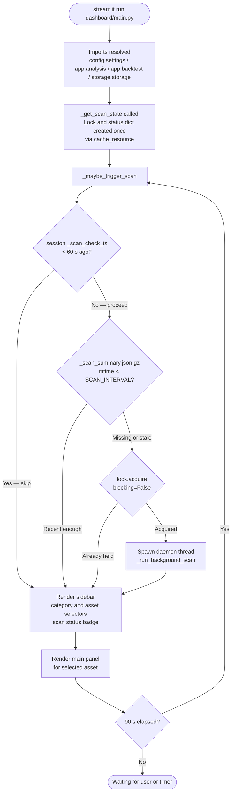

---

## 2. Background Full-Market Scan

`_run_background_scan` delegates entirely to `app.scan.run_scan()`. News is fetched once and reused across all 24 assets processed sequentially. Per-asset snapshots are saved via `analyse_asset(save=True)`.

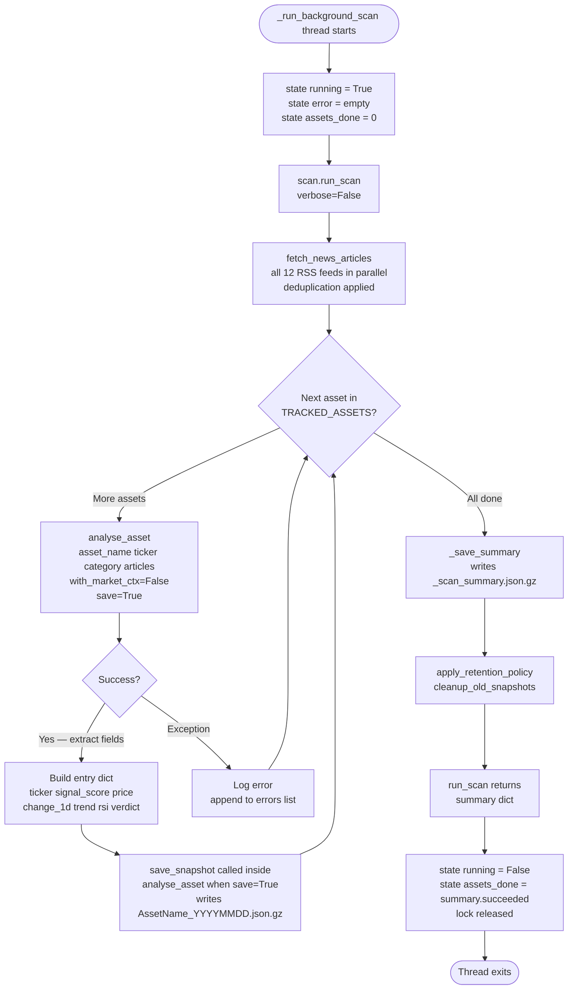

---

## 3. Price Data Pipeline

`fetch_price_history` retrieves raw OHLCV data. `compute_price_metrics` and `compute_momentum_metrics` derive all scalar indicators from the Close series.

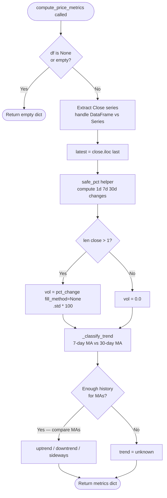

---

## 4. Momentum Metrics Pipeline

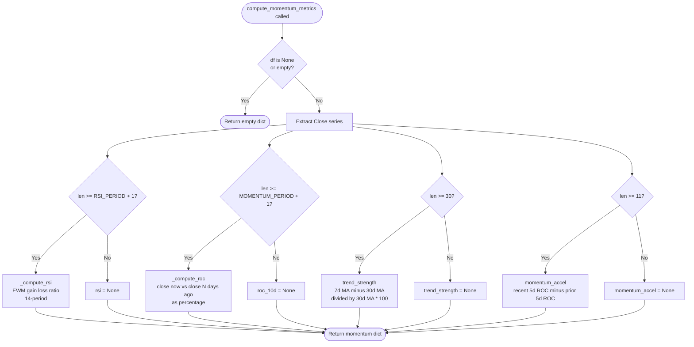

---

## 5. News Ingestion and Deduplication Pipeline

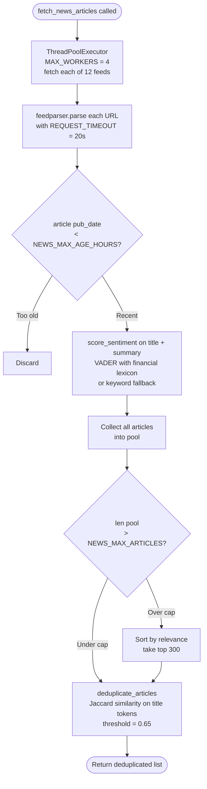

---

## 6. News Correlation Pipeline

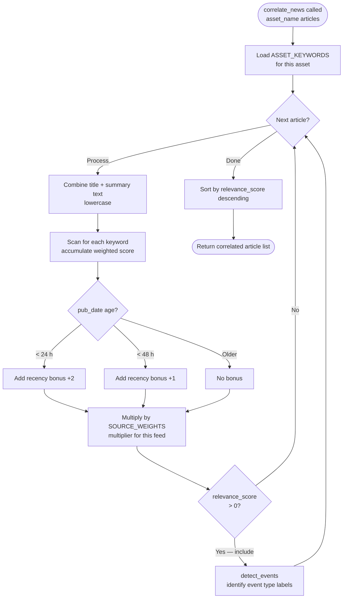

---

## 7. Signal Scoring Pipeline

Six components are computed from separate data sources, each multiplied by an asset-class-specific weight, then summed and clamped to the -10 to +10 range.

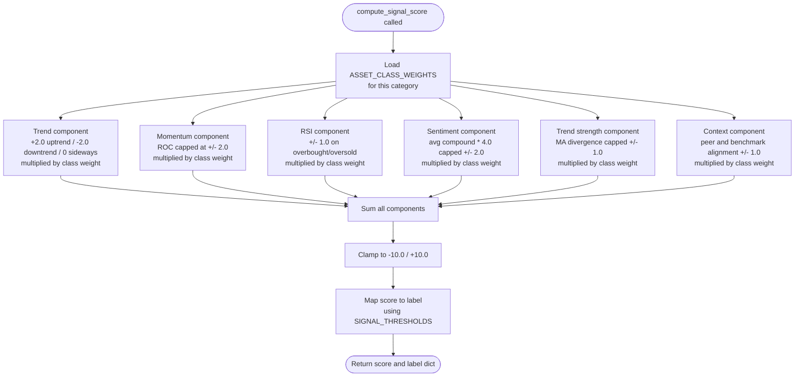

---

## 8. Market Context Analysis Pipeline

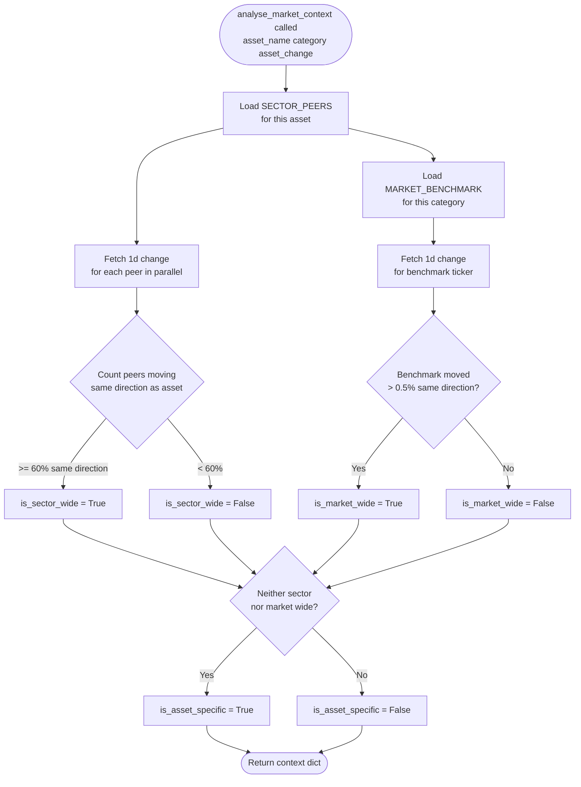

---

## 9. Explanation Builder Pipeline

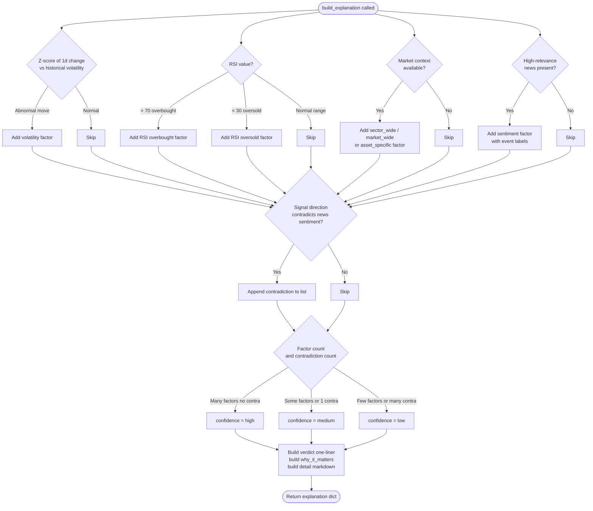

---

## 10. Storage Persistence Pipeline

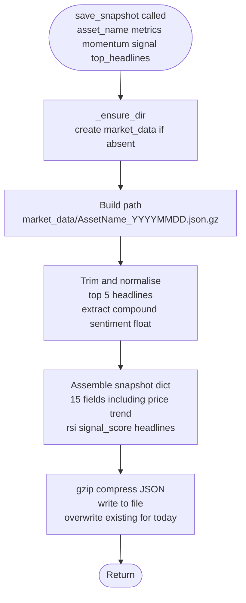

---

## 11. Retention Policy Pipeline

Run automatically at the end of each scan.

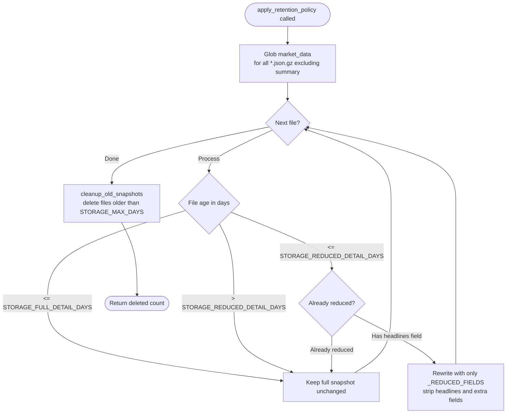

---

## 12. Backtesting Pipeline

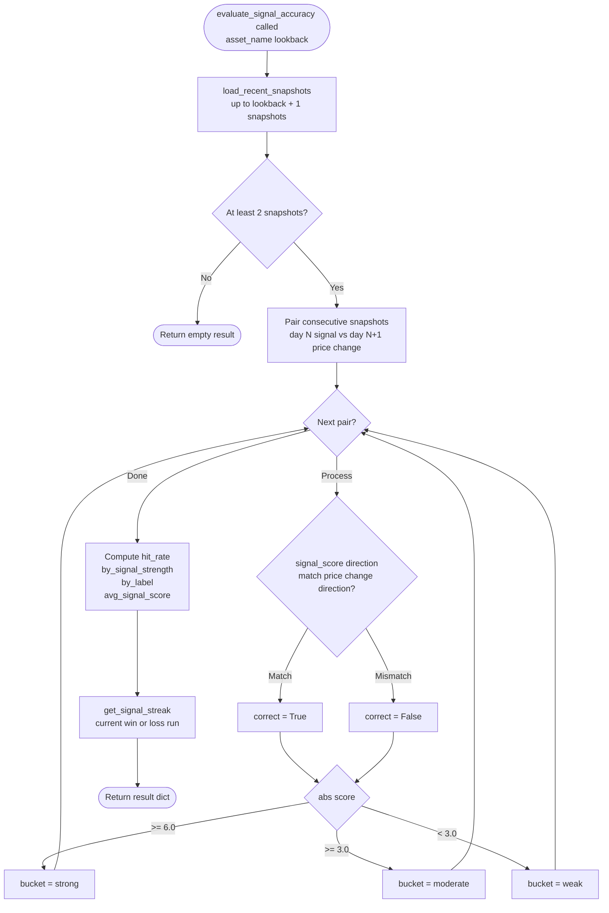

---

## 13. Full analyse_asset Orchestration

This is the top-level function called by both `app/scan.py` and directly by `dashboard/main.py`.

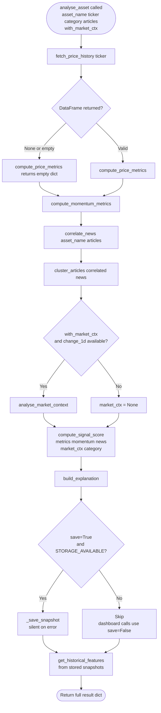

---

## 14. Parallel Metrics Pre-fetch Pipeline

Note: `fetch_all_metrics_parallel` is defined in `src/engine.py` and re-exported via `app/analysis.py`, but the dashboard does **not** call it directly. The market heatmap and category overview are populated from `cached_scan_summary()` in `dashboard/data.py`, which reads the pre-computed `_scan_summary.json.gz` written by the scan pipeline. The diagram below shows `fetch_all_metrics_parallel` for reference — it is available for external use but bypassed by the current dashboard flow.

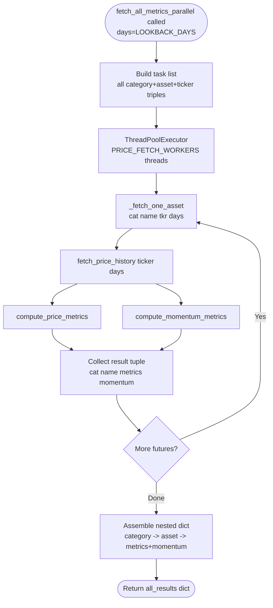
