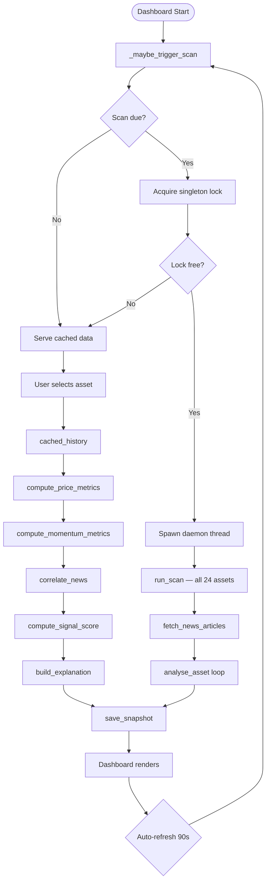

# PulseEngine                        [](https://ko-fi.com/M4M11X86KI)

[](https://www.python.org/)
[](LICENSE)
[](https://streamlit.io/)
[](https://pandas.pydata.org/)
[](https://plotly.com/)
[](https://finance.yahoo.com/)
[](https://en.wikipedia.org/wiki/RSS)
[]()
[](CONTRIBUTING.md)
[](DISCLAIMER.md)

Originally Created by *Bhargavaram Krishnapur (Codex-Crusader)*

_LINK TO LIVE DEPLOYMENT: [HERE!!!](https://pulseengine.streamlit.app/)_


---

A real-time market analysis dashboard that combines technical price indicators, multi-source news sentiment, and event-driven signal generation into a single composite score for 24 tracked assets across commodities, cryptocurrencies, technology equities, and market indices.

All data is sourced from free, publicly available feeds. No proprietary APIs, no paid data subscriptions, and no trading execution. The platform is an analytical tool only.

---

## Table of Contents

- [Overview](#overview)
- [Features](#features)
- [Architecture](#architecture)
- [Asset Coverage](#asset-coverage)
- [Quick Start](#quick-start)
- [Installation](#installation)
- [Running the Dashboard](#running-the-dashboard)
- [Running a Full Scan](#running-a-full-scan)
- [Configuration](#configuration)
- [Signal Interpretation](#signal-interpretation)
- [Data Storage](#data-storage)
- [Backtesting](#backtesting)
- [Project Structure](#project-structure)
- [Documentation](#documentation)
- [Roadmap](#roadmap)
- [Contributing](#contributing)
- [Disclaimer](#disclaimer)
- [License](#license)

---

## Overview

The platform processes data from two independent sources on each analysis cycle:

- **Price data** — 30-day OHLCV history fetched from Yahoo Finance via `yfinance`
- **News data** — up to 300 articles ingested in parallel from 12 curated RSS feeds, deduplicated using Jaccard similarity, and scored using VADER sentiment analysis augmented with a financial lexicon

These two streams are merged into a composite signal score ranging from -10 (Strong Bearish) to +10 (Strong Bullish) using weighted contributions from six sub-components: trend direction, price momentum, RSI oscillator reading, news sentiment, trend strength, and market/sector context. Each asset class applies its own weighting profile to reflect how different market types respond to different signal types.

Historical snapshots are persisted to compressed JSON files on disk. A background scan thread processes all 24 assets every 30 minutes without blocking the dashboard UI.

---

## Features

| Feature | Detail |
|---|---|
| Signal scoring | Composite score -10 to +10 across 6 weighted components |
| Asset classes | Commodities, Cryptocurrency, Tech Stocks, Market Indices |
| News ingestion | 12 public RSS feeds, parallel fetch, Jaccard deduplication |
| Sentiment engine | VADER with injected financial lexicon, keyword fallback |
| Event detection | 8 event categories (central bank, geopolitical, earnings, etc.) |
| Market context | Sector peer comparison and benchmark alignment analysis |
| Background scan | Full 24-asset scan every 30 minutes via daemon thread |
| Historical storage | Compressed per-asset JSON snapshots with tiered retention |
| Backtesting | Hit-rate evaluation by signal strength and label |
| Retention policy | Full detail 7 days, reduced detail 30 days, deleted after 60 days |
| Dashboard | Streamlit wide-layout with auto-refresh every 90 seconds |
| Top movers | Live 24h gainers and losers in sidebar |
| Market heatmap | Category-level 24h change heatmap |
| Category overview | Tabular summary of all assets in selected category |

---

## Architecture



---

## Asset Coverage

[]()
[]()
[]()
[]()

| Category | Assets |
|---|---|
| Commodities | Gold, Silver, Crude Oil, Natural Gas, Copper, Platinum, Wheat, Corn |
| Cryptocurrency | Bitcoin, Ethereum, Monero, Solana, Litecoin |
| Tech Stocks | Apple, Microsoft, NVIDIA, Google, Amazon, Meta, Tesla |
| Market Indices | S&P 500, NASDAQ, Dow Jones, VIX (Fear Index) |

---

## Quick Start

```bash
# 1. Clone the repository
git clone https://github.com/The-Pulse-Engine/Pulse-Engine_Market_Intelligence_Platform.git
cd Pulse-Engine_Market_Intelligence_Platform

# 2. Create and activate a virtual environment
# Python 3.11–3.14 are all supported
python -m venv .venv
# Windows
.venv\Scripts\activate
# macOS / Linux
source .venv/bin/activate

# 3. Install dependencies
pip install -r requirements.txt

# Optional: install developer tooling for tests and linting
pip install -r requirements-dev.txt

# 4. Run the dashboard
streamlit run dashboard/main.py
```

The dashboard opens at `http://localhost:8501`. A full-market background scan starts automatically on first load and repeats every 30 minutes.

---

## Quick Start (Docker)

```bash
docker build -t market-intel .
docker run -p 8501:8501 market-intel
```

Dashboard available at `http://localhost:8501`.

---

## Installation

### Requirements

- Python 3.11–3.14 (all supported; `pip install -r requirements.txt` works out of the box on all four versions)
- Internet connection (Yahoo Finance and RSS feeds)

### Dependencies

| Package | Minimum Version | Purpose |
|---|---|---|
| streamlit | 1.54.0 | Dashboard framework |
| yfinance | 1.2.1 | Price history via Yahoo Finance |
| pandas | 2.3.3 | DataFrame operations |
| plotly | 6.6.0 | Interactive charts and heatmap |
| feedparser | 6.0.12 | RSS feed ingestion |
| vaderSentiment | 3.3.2 | Sentiment analysis |

Install the pinned runtime dependencies first:

```bash
pip install -r requirements.txt
```

For development, linting, and testing tools, install:

```bash
pip install -r requirements-dev.txt
```

---

## Running the Dashboard

```bash
streamlit run dashboard/main.py
```

On startup the dashboard:

1. Renders the sidebar with category and asset selectors
2. Checks whether a full-market scan is due
3. Launches a background daemon thread to scan all 24 assets if the last scan summary is missing or older than 30 minutes
4. Displays `System initializing — full market scan running in background...` while the scan is active
5. Fetches price and news data for the currently selected asset and renders the full analysis panel

The sidebar shows the scan status (running / N minutes ago / pending first run) and a manual `Run full scan now` button.

---

## Running a Full Scan

The scan pipeline can be executed independently of the dashboard:

```bash
# Full verbose scan — saves snapshots and summary
python app/scan.py

# Suppress per-asset log lines
python app/scan.py --quiet

# Validate pipeline without writing any files
python app/scan.py --dry-run
```

Output is written to:
- `market_data/<AssetName>_YYYYMMDD.json.gz` — per-asset daily snapshot
- `market_data/_scan_summary.json.gz` — hierarchical summary of latest scan

---

## Configuration

All tunable values are in `config/settings.py`. No magic numbers exist anywhere else in the codebase.

| Constant | Default | Description |
|---|---|---|
| `LOOKBACK_DAYS` | 30 | Price history window in days |
| `NEWS_MAX_AGE_HOURS` | 96 | Maximum article age accepted |
| `NEWS_MAX_ARTICLES` | 300 | Article pool cap before correlation |
| `PRICE_CACHE_TTL` | 90 s | Dashboard price cache lifetime |
| `NEWS_CACHE_TTL` | 300 s | Dashboard news cache lifetime |
| `SCAN_INTERVAL_MINUTES` | 30 | Background scan frequency |
| `MAX_WORKERS` | 4 | Parallel threads for data fetching |
| `RSI_PERIOD` | 14 | RSI calculation window |
| `MOMENTUM_PERIOD` | 10 | Rate-of-change calculation window |
| `DEDUP_SIMILARITY_THRESHOLD` | 0.65 | Jaccard cutoff for deduplication |
| `PRICE_CHANGE_THRESHOLD` | 2.0 % | Threshold for significant move alert |
| `RELEVANCE_HIGH` | 6 | Score threshold for high-relevance news |
| `RELEVANCE_MEDIUM` | 3 | Score threshold for medium-relevance news |
| `STORAGE_FULL_DETAIL_DAYS` | 7 | Days to retain full snapshots |
| `STORAGE_REDUCED_DETAIL_DAYS` | 30 | Days to retain reduced snapshots |
| `STORAGE_MAX_DAYS` | 60 | Days before snapshot deletion |

### Signal Thresholds

| Label | Score Range |
|---|---|
| Strong Bullish | >= 6.0 |
| Bullish | >= 3.0 |
| Slightly Bullish | >= 1.0 |
| Neutral | -1.0 to 1.0 |
| Slightly Bearish | >= -3.0 |
| Bearish | >= -6.0 |
| Strong Bearish | < -6.0 |

## Signal Interpretation

Signal scores are a compact summary of price action, momentum, sentiment, and context.
Use the ranges below as a quick interpretation guide when scanning assets in the dashboard:

| Score Range | Interpretation |
|---|---|
| +6 to +10 | Strong Bullish |
| +2 to +6 | Bullish |
| -2 to +2 | Neutral |
| -6 to -2 | Bearish |
| -10 to -6 | Strong Bearish |

These ranges are intentionally broad so the label remains readable even as individual
signal components shift over time.

### Per-Asset-Class Signal Weights

| Component | Crypto | Tech Stocks | Commodities | Indices |
|---|---|---|---|---|
| Trend | 1.2x | 1.2x | 1.3x | 1.5x |
| Momentum | 1.8x | 1.0x | 1.0x | 1.2x |
| RSI | 0.8x | 1.0x | 0.8x | 0.5x |
| Sentiment | 1.2x | 1.6x | 1.2x | 1.0x |
| Trend Strength | 1.2x | 1.0x | 1.0x | 1.2x |
| Context | 0.5x | 1.2x | 1.2x | 1.5x |

---

## Data Storage

Snapshots are stored as gzip-compressed JSON files under `market_data/`:

```
market_data/
  Gold_20260401.json.gz
  Bitcoin_20260401.json.gz
  ...
  _scan_summary.json.gz
```

### Retention Tiers

| Age | Fields Retained |
|---|---|
| 0 – 7 days | Full snapshot including top 5 headlines |
| 8 – 30 days | Reduced: price, change_1d, signal_score, signal_label, trend, rsi, roc_10d, trend_strength |
| > 60 days | Deleted automatically after each scan |

---

## Backtesting

The backtesting module evaluates historical signal accuracy by comparing the signal score on day N with the actual price direction from day N to day N+1.

```python
from app.backtest import evaluate_signal_accuracy
result = evaluate_signal_accuracy("Gold", lookback=20)
print(result["hit_rate"])
```

Results are broken down by:
- Overall hit rate
- Accuracy by signal strength (strong / moderate / weak)
- Accuracy per signal label
- Current win or loss streak

---

## Project Structure

```
pulse_engine_1/
  app/
    __init__.py
    analysis.py         Re-export shim + CLI entry point (wraps src/ modules)
    scan.py             Full-market batch scan pipeline
    backtest.py         Historical signal accuracy evaluation
  dashboard/
    __init__.py
    main.py             Streamlit dashboard controller
    components.py       Reusable UI rendering functions
    styles.py           CSS theming for the dashboard
    data.py             Cached data loaders and staleness helpers
  storage/
    __init__.py
    storage.py          Compressed snapshot persistence and retention
  config/
    __init__.py
    settings.py         All configuration constants
  src/
    __init__.py
    engine.py           Pipeline orchestration (analyse_asset, run_full_scan)
    price.py            Yahoo Finance fetching and price metrics
    news.py             RSS fetching, deduplication, and clustering
    signals.py          Signal scoring, event detection, news correlation
    context.py          Sector and market context analysis
    explanation.py      Human-readable narrative generation
    sentiment.py        VADER + financial-lexicon sentiment scoring
    errors.py           Custom exception types (PipelineError hierarchy)
  assets/
    icons/
      favicon.ico
    logo/
      pulseengine_logo.png
  tests/
    conftest.py              Shared fixtures
    test_core.py             Sanity and invariant tests for pure functions
    test_pipeline.py         Smoke tests for end-to-end pipelines
    test_logic_coverage.py   Edge case coverage for scoring, sentiment, dedup
    test_storage_and_scan.py Storage round-trip, retention, dry-run scan, backtest
    MAINTENANCE.md           Guide for updating the test suite
  Docs/
    code_flow.md        Detailed execution flow diagrams
    variable_list.md    Complete variable and constant reference
    ROADMAP.md          Project direction, milestones, and contributor lanes
    CHANGELOG.md        All notable changes by version
    DISCLAIMER.md       Legal and financial disclaimer
  requirements.txt      Python dependencies
  requirements-dev.txt  Test dependencies (pytest, pytest-mock)
  README.md             This file
  CONTRIBUTING.md       Contribution guidelines
  LICENSE               MIT License
  .gitignore            Git ignore rules
  market_data/          Runtime snapshot directory (git-ignored)
```

---

## Documentation

| Document | Description |
|---|---|
| [Docs/code_flow.md](Docs/code_flow.md) | Step-by-step execution flow for every pipeline with Mermaid diagrams |
| [Docs/variable_list.md](Docs/variable_list.md) | Complete reference of all variables, constants, and return structures |
| [CONTRIBUTING.md](CONTRIBUTING.md) | How to report issues, propose changes, and submit pull requests |
| [DISCLAIMER.md](Docs/DISCLAIMER.md) | Financial, legal, and data accuracy disclaimers |
| [CHANGELOG.md](Docs/CHANGELOG.md) | All notable changes by version |
| [Docs/ROADMAP.md](Docs/ROADMAP.md) | Project direction, milestones, and contributor lanes |

---

## Contributing

Contributions are welcome. Please read [CONTRIBUTING.md](CONTRIBUTING.md) before opening a pull request. All contributors must follow the code style and testing requirements described there.

[](https://github.com/The-Pulse-Engine/Pulse-Engine_Market_Intelligence_Platform/issues)
[](https://github.com/The-Pulse-Engine/Pulse-Engine_Market_Intelligence_Platform/pulls)

---

## Roadmap

PulseEngine is being built toward a local-first desktop application — a full-power EXE that runs entirely on your machine with no cloud dependency, no accounts, and no data leaving your device. The Streamlit deployment is a live demo with restricted features.

Planned milestones:
- **v0.3** — Arbitrary ticker support, local installer (repo restructure done in v0.2.1)
- **v0.4** — Desktop EXE via PyInstaller, GitHub Actions build pipeline
- **v0.5** — FinBERT running locally, offline mode, export features
- **v1.0** — Full market coverage, dynamic asset discovery, all stocks

See [Docs/ROADMAP.md](Docs/ROADMAP.md) for the full breakdown including what's out of scope and how to contribute to specific milestones.

---

## Disclaimer

This software is provided for informational and educational purposes only. It does not constitute financial advice, investment advice, trading advice, or any other form of advice. See [DISCLAIMER.md](Docs/DISCLAIMER.md) for the full disclaimer.

---

## License

This project is licensed under the MIT License. See [LICENSE](LICENSE) for the full text.

[](LICENSE)
